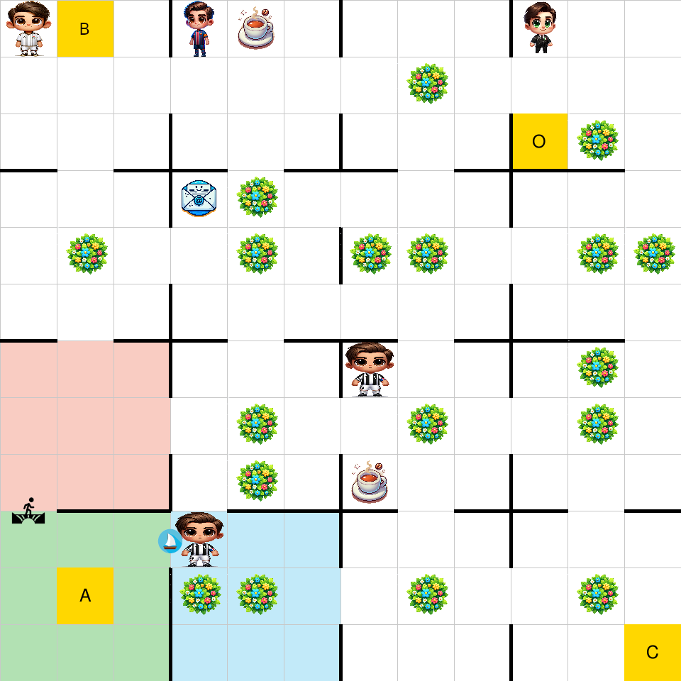
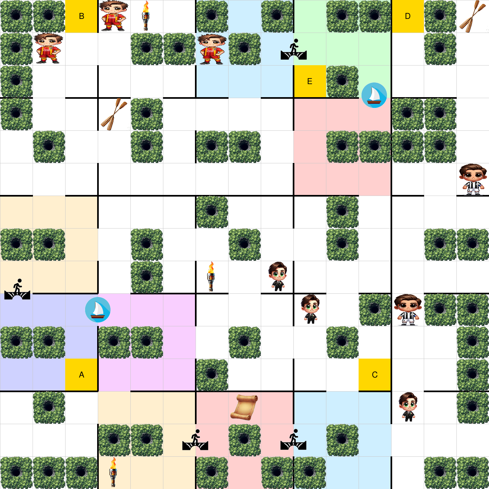
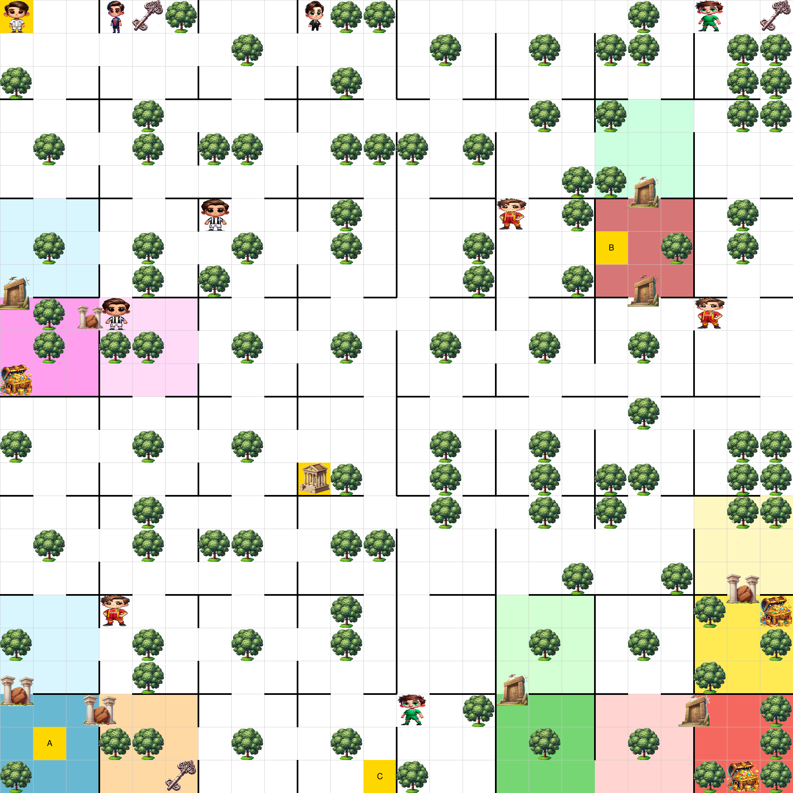

# MAPRL — Multi-Agent Planning for Reinforcement Learning with Reward Machines

**Repository:** https://github.com/Alee08/maprl  
**Paper (ECAI 2025):** https://doi.org/10.3233/FAIA251253  
**Companion library (required):** https://github.com/Alee08/multiagent-rl-rm

> **Note**  
> MAPRL **explicitly depends on** `multiagent-rl-rm`.  
> This dependency is declared in `setup.py`, so `pip install -e .` will automatically pull it from PyPI.

---

## Overview

**MAPRL** fuses **partial-order planning (POP)** with **Reward Machines (RMs)** to tackle **strongly-coupled cooperative MARL**.  
The planner produces a POP, the POP is compiled into **one RM per agent**, and each agent runs an off-the-shelf learner (e.g., Q-Learning) guided by its RM state while public joint actions fire when their preconditions are satisfied.

This repository provides the **MAPRL library** that performs POP→RM synthesis and exposes utilities to coordinate distributed learners via RMs, together with grid-based environments and thin wrappers that expose RM state to learners.

### Key features

- Transforms a multi-agent planning problem (MAP) into a partial-order plan (POP), then into one Reward Machine (RM) per agent.
- Explicitly models concurrency and synchronization points in the RM, so joint actions are triggered automatically when their preconditions hold.
- Supports agents with private (stochastic) and public (deterministic) actions in a cooperative MARL setting.
- Dramatically reduces sample complexity on strongly-coupled tasks by combining planning and distributed RL.

---

## Environments

<p align="center">
  
  
  
</p>
<p align="center"><em>From left to right: Office World, Concurrent Maze, Temple Quest.</em></p>


## Planning pipeline in MAPRL

The “planning” side of MAPRL is implemented using the multi-agent extension of [Unified Planning](https://github.com/aiplan4eu/unified-planning):

- For each domain (maze, office world, temple quest) we define a **`MultiAgentProblem`** with:
  - high-level public actions (e.g., `move`, `start_open_employer_door`, `push_button`),
  - shared environment fluents (e.g., room connectivity, door status, buttons),
  - and a joint goal (e.g., all agents reaching a target room while the system is “free”).

- This planning model is exported to **MA-PDDL** and solved with **FMAP**, which returns a **partial-order plan (POP)** capturing causal and concurrency constraints between joint actions.

- MAPRL then **compiles the POP into one Reward Machine per agent**:
  - each RM encodes that agent’s sequence of high-level responsibilities (doors to open, buttons to press, rooms to reach),
  - and is later used to guide QRM during learning.

The scripts that build and solve the planning models, and that turn POPs into RMs, live under:

```text
multiagentplanning_rl/environments/integration_planning_and_learning/planning_utils/

```

Most users will just run the provided experiments (which load pre-generated POP→RM artifacts), but the full planning pipeline is available if you want to regenerate or modify the tasks.


## Project Structure

### Main components

- `multiagentplanning_rl/multi_agent/reward_machine.py` — RM semantics shared by all environments.
- `multiagentplanning_rl/environments/integration_planning_and_learning/ma_environment.py` — base environment that wires POP artifacts, agents, and RMs.
- `multiagentplanning_rl/multi_agent/wrappers/rm_environment_wrapper.py` — observation wrapper adding RM state to the agents.
- `multiagentplanning_rl/render/render.py` — optional Pygame renderer for grid maps, agents, and interactable objects.
- `multiagentplanning_rl/utils/` — helper utilities for grounding, RM simplification, state evaluation, and sequential simulation.

### Files and directories

- `multiagentplanning_rl/environments/integration_planning_and_learning/` — shared environment utilities, per-experiment configs, and the Unified Planning + FMAP pipeline under `planning_utils/` (MAP → POP → per-agent RMs).
- `concurrent_maze/maze_main.py` — entry point for the maze tasks.
- `concurrent_office_world/office_world_main.py` — entry point for the office world tasks.
- `concurrent_temple_quest/temple_quest_main.py` — entry point for the temple quest tasks.
- `requirements.txt` — dependency pins; the companion `multiagent-rl-rm` library is auto-installed via `setup.py`.

---

## Requirements

- Python ≥ 3.10  
- [`multiagent-rl-rm`](https://github.com/Alee08/multiagent-rl-rm) (installed automatically by `pip install -e .`)  
- Standard scientific Python stack (NumPy, etc.)  
- Optional: [Weights & Biases](https://wandb.ai/) for logging (`--wandb_enabled`)

---

## Installation (developer mode)

> MAPRL is **not yet on PyPI**. Install it in **developer mode**.

```bash
# Clone MAPRL
git clone https://github.com/Alee08/maprl
cd maprl

pip install -e .

```

The command above will automatically install the dependency `multiagent-rl-rm` from PyPI (as specified in `setup.py`).

## Running the experiments

You can run the experiments using the command-line interface.  
All three environments share the same CLI contract:

- `--num_episodes` (default `20000`) — length of the training loop.  
- `--wandb_enabled` — opt-in Weights & Biases logging (off by default).
- `--experiment` (`exp1`, `exp2`, or `exp3`) — selects the task variant for the chosen domain.

Each domain (maze, office world, and temple quest) defines three predefined experiments: `exp1`, `exp2`, and `exp3` (see the paper for the exact setup of each variant).


Run each experiment after `pip install -e .`.  
The most direct approach is to `cd` into the folder that contains the entry point and execute the script (e.g., `python office_world_main.py`).  
If you prefer, you can stay at the repo root and call the module with `python -m ...`, which resolves imports the same way.

### Office World

```bash
cd multiagentplanning_rl/environments/integration_planning_and_learning/concurrent_office_world
python office_world_main.py --num_episodes 20000 --experiment exp1 --wandb_enabled
```

### Maze
```bash
cd multiagentplanning_rl/environments/integration_planning_and_learning/concurrent_maze
python maze_main.py --num_episodes 20000 --experiment exp1 --wandb_enabled
```

### Temple Quest
```bash
cd multiagentplanning_rl/environments/integration_planning_and_learning/concurrent_temple_quest
python temple_quest_main.py --num_episodes 20000 --experiment exp1 --wandb_enabled
```

Each entry point runs its predefined scenario without extra flags; drop `--wandb_enabled` if you do not want to send metrics to W&B.

## Example Environment Configuration

The environment is defined using a grid-like structure with various objects such as walls, plants, and goals. The `map_1` string in `office_world_main.py` represents the grid layout, where:

- 🟩 - Empty space
- ⛔ - Wall
- 🚪 - Door
- 🥤 - Coffee station
- 🪴 - Plant
- ✉️ - Letter
- `A`, `B`, `C`, `O` etc. - Indicate specific goal locations

The positions and connections of the grid are parsed using custom parsing functions, such as `parse_office_world_`.

## Example Map (Office World)

Below is the emoji-based map used in `office_world_main.py` (parsed into rooms, doors, walls, and goal locations):
```python
map_1 = """
 B  🟩 🟩 ⛔ 🟩 🥤 🟩 ⛔ 🟩 🟩 🟩 ⛔ 🟩 🟩 🟩
 🟩 🟩 🟩 🚪 🟩 🟩 🟩 🚪 🟩 🪴 🟩 🚪 🟩 🟩 🟩
 🟩 🟩 🟩 ⛔ 🟩 🟩 🟩 ⛔ 🟩 🟩 🟩 ⛔ O  🪴 🟩
 ⛔ 🚪 ⛔ ⛔ ⛔ 🚪 ⛔ ⛔ ⛔ 🚪 ⛔ ⛔ ⛔ ⛔ 🚪
 🟩 🟩 🟩 ⛔ ✉️  🪴 🟩 🚪 🟩 🟩 🟩 ⛔ 🟩 🟩 🟩
 🟩 🪴 🟩 🚪 🟩 🪴 🟩 ⛔ 🪴 🪴 🟩 🚪 🟩 🪴 🪴
 🟩 🟩 🟩 ⛔ 🟩 🟩 🟩 🚪 🟩 🟩 🟩 ⛔ 🟩 🟩 🟩
 ⛔ 🚪 ⛔ ⛔ ⛔ 🚪 ⛔ ⛔ ⛔ 🚪 ⛔ ⛔ ⛔ ⛔ 🚪
 🟩 🟩 🟩 ⛔ 🟩 🟩 🟩 ⛔ 🟩 🟩 🟩 ⛔ 🟩 🪴 🟩
 🟩 🟩 🟩 🚪 🟩 🪴 🟩 🚪 🟩 🪴 🟩 🚪 🟩 🪴 🟩
 🟩 🟩 🟩 ⛔ 🟩 🪴 🟩 ⛔ 🥤 🟩 🟩 ⛔ 🟩 🟩 🟩
 🚪 ⛔ ⛔ ⛔ 🚪 ⛔ ⛔ ⛔ ⛔ 🚪 ⛔ ⛔ ⛔ 🚪 ⛔
 🟩 🟩 🟩 🚪 🟩 🟩 🟩 ⛔ 🟩 🟩 🟩 ⛔ 🟩 🟩 🟩
 🟩 A  🟩 ⛔ 🪴 🪴 🟩 🚪 🟩 🪴 🟩 🚪 🟩 🪴 🟩
 🟩 🟩 🟩 ⛔ 🟩 🟩 🟩 ⛔ 🟩 🟩 🟩 ⛔ 🟩 🟩 C
 """
```

## Actions

The agents can perform various actions, including:

- `up`, `down`, `left`, `right` – Move between rooms.
- `cross_door_up`, `cross_door_down`, `cross_door_left`, `cross_door_right` - Cross the employee's door.
- `manager_door_up`, `manager_door_down`, `manager_door_left`, `manager_door_right` - Cross the manager's door.
- `cell_up`, `cell_down`, `cell_left`, `cell_right` - Move within cells of rooms.
- `wait` - Stay in the current position.


## Quickstart (library usage)

You can also use MAPRL as a Python library to build your own experiments:

```python
from multiagentplanning_rl.environments.integration_planning_and_learning.ma_environment import MAP_RL_Env
from multiagentplanning_rl.multi_agent.wrappers.rm_environment_wrapper import RMEnvironmentWrapper

env = MAP_RL_Env(width=4, height=4, walls=..., plant=..., cell_size=3)
rm_env = RMEnvironmentWrapper(env, agents=[...])

obs, infos = rm_env.reset()
for _ in range(100):
    actions = {ag.name: ag.sample_action(obs[ag.name]) for ag in rm_env.agents}
    obs, rewards, done, trunc, infos = rm_env.step(actions)
    if all(done.values()):
        break
```

## Citing MAPRL

If you use this code or ideas from the paper, please cite:

> Alessandro Trapasso and Anders Jonsson.  
> **Concurrent Multiagent Reinforcement Learning with Reward Machines.**  
> *ECAI 2025, Frontiers in Artificial Intelligence and Applications.*

```bibtex
@inproceedings{Trapasso2025MAPRL,
  author    = {Trapasso, Alessandro and Jonsson, Anders},
  title     = {Concurrent Multiagent Reinforcement Learning with Reward Machines},
  booktitle = {{ECAI} 2025 - 28th European Conference on Artificial Intelligence},
  series    = {Frontiers in Artificial Intelligence and Applications},
  volume    = {413},
  pages     = {3735--3742},
  publisher = {IOS Press},
  year      = {2025},
  doi       = {10.3233/FAIA251253},
}
```

## License

MAPRL is released under the **Apache 2.0 License**.  
See the `LICENSE` file for details.
